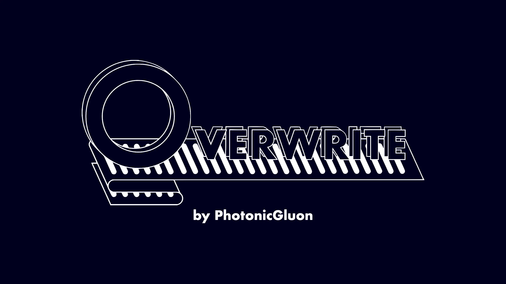

# photonicgluon.github.io (Overwrite)

Overly obsessive projects by PhotonicGluon.

The idea for *Overwrite* was conceived in 2021, but I did not start to properly develop it until February 2023. It
serves as a portfolio site for my projects; a nice display of the things that I have done and are currently doing. I
will continue to update it until I stop making things.

Visit the site [here](https://overwrite.site/).

Licensed under the [MIT licence](LICENSE).
